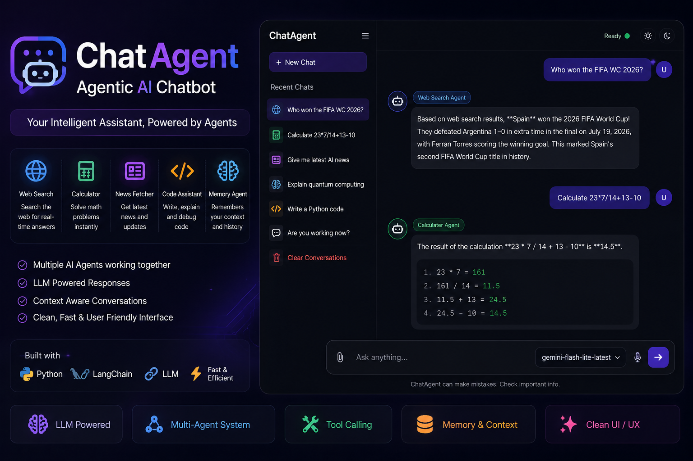
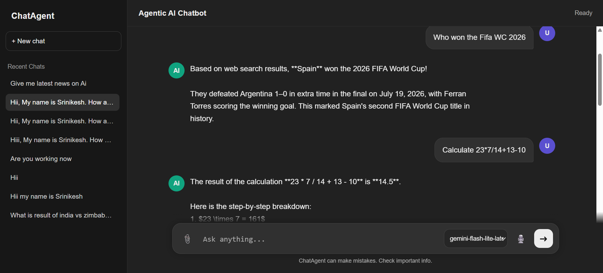
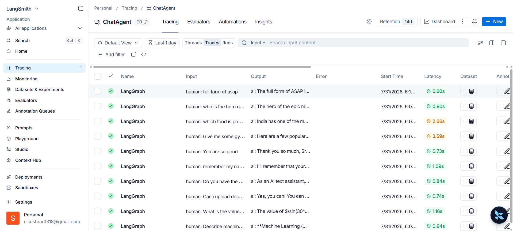
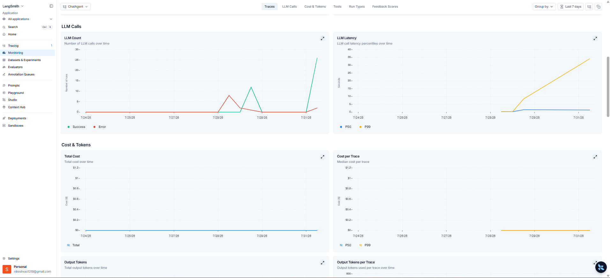
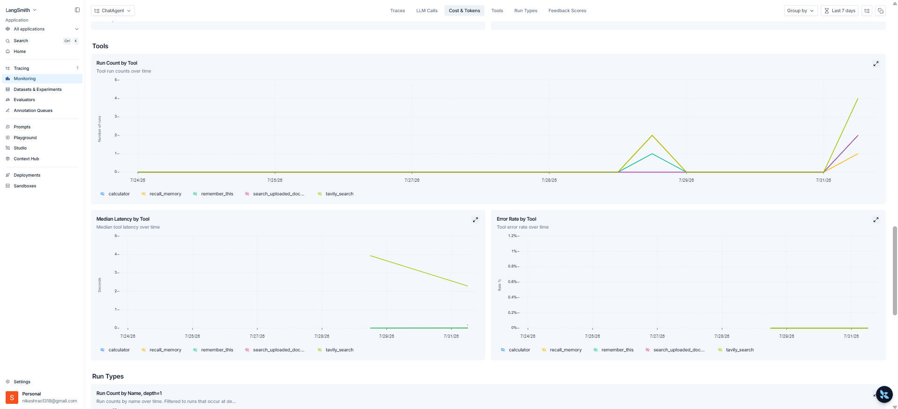

# 🤖 ChatAgent – Agentic AI Chatbot with LangGraph & RAG

<p align="center">


</p>

---

## 🚀 Live Demo

🌐 **Try ChatAgent**

**http://ec2-100-31-54-129.compute-1.amazonaws.com:8080/**

---

## 🎥 Project Demo

<p align="center">

<a href="https://github.com/user-attachments/assets/719a2695-153e-43a4-834b-5f23d8473ca0">



</a>

<br>

<b>▶ Click the thumbnail above to watch the complete demo.</b>

</p>

---

# 📖 Overview

ChatAgent is an **Agentic AI chatbot** inspired by ChatGPT that intelligently decides **when to answer directly** and **when to invoke specialized tools** such as **Web Search**, **Calculator**, and **Retrieval-Augmented Generation (RAG)**.

Built with **LangGraph**, **LangChain**, **Google Gemini**, **FastAPI**, and **ChromaDB**, the application supports real-time streaming, conversation memory, document understanding, persistent chat history, voice input, and multi-model selection.

The application is containerized using **Docker** and deployed on **AWS EC2** through a fully automated **GitHub Actions CI/CD pipeline** using **Amazon ECR**.

---

# 📸 Application Preview

## Home Interface

<p align="center">



</p>

A clean ChatGPT-inspired interface with:

- Multi-chat support
- Sidebar conversations
- Voice input
- Model selection
- Streaming responses

---

The chatbot can:

- 🌐 Search the web
- 🧮 Solve calculations
- 📄 Answer from uploaded documents
- 🧠 Remember previous conversations

using a single conversational interface.

---

# 📊 LangSmith Observability

The project integrates **LangSmith** to trace, debug, and monitor every execution of the LangGraph workflow.

This provides complete visibility into:

- LLM calls
- Tool execution
- Response latency
- Token usage
- Workflow tracing
- Errors and debugging

---

## Workflow Traces

<p align="center">

</p>

Each user interaction generates a complete execution trace, making it easy to understand how the agent reasoned and which tools were invoked before generating the final response.

---

## LLM Monitoring

<p align="center">

</p>

Monitor:

- Token consumption
- Request latency
- Success & failure rates
- Model performance
- Cost analysis

---

## Tool Analytics

<p align="center">

</p>

Track the usage and performance of each integrated tool, including:

- 🌐 Tavily Web Search
- 🧮 Calculator
- 📄 Document Retrieval (RAG)

These insights simplify debugging and help optimize application performance.

---

# ✨ Features

✅ Agentic AI powered by LangGraph

✅ Real-time streaming responses

✅ Web Search using Tavily

✅ Calculator Tool

✅ Upload Documents for RAG

✅ ChromaDB Vector Database

✅ Persistent Chat History

✅ Conversation Memory

✅ Voice Input

✅ Multiple Gemini Models

✅ Dockerized Deployment

✅ AWS CI/CD with GitHub Actions

✅ LangSmith Monitoring

---

# 🛠 Core Capabilities

| Capability | Description |
|------------|-------------|
| 🌍 Web Search | Retrieves latest information using Tavily |
| 📄 RAG | Answers questions from uploaded documents |
| 🧮 Calculator | Executes mathematical expressions |
| 🧠 Memory | Maintains conversational context |
| 💬 Chat History | Stores previous conversations |
| 🎙 Voice Input | Speak instead of typing |
| ⚡ Streaming | Token-by-token responses |
| 🤖 Multi-Model | Switch between Gemini models |
| 🐳 Docker | Containerized deployment |
| ☁ AWS | Production deployment on EC2 |

---

# 🏗️ High-Level Architecture

```text
                User
                  │
                  ▼
          FastAPI Web Interface
                  │
                  ▼
            LangGraph Agent
                  │
     ┌────────────┼─────────────┐
     │            │             │
     ▼            ▼             ▼
 Web Search   Calculator     Document RAG
   Tavily                     ChromaDB
     │            │             │
     └────────────┼─────────────┘
                  │
                  ▼
          Google Gemini LLM
                  │
                  ▼
          Streaming Response
```

---

# ⭐ Why ChatAgent?

Unlike a traditional chatbot that only sends prompts to an LLM, ChatAgent uses an **Agentic AI architecture** capable of selecting tools, retrieving external knowledge, maintaining context, and producing more accurate responses.

This demonstrates practical experience with **LLM orchestration**, **tool calling**, **RAG**, **vector databases**, **cloud deployment**, and **production-ready AI systems**.

---

# ⚙️ Agent Workflow

ChatAgent is built using **LangGraph**, enabling the LLM to reason about a user's request and dynamically decide whether to answer directly or invoke specialized tools.

```text
                    User Prompt
                         │
                         ▼
                  LangGraph Router
                         │
        ┌────────────────┼────────────────┐
        │                │                │
        ▼                ▼                ▼
   Web Search      Calculator        Document RAG
    (Tavily)                           (ChromaDB)
        │                │                │
        └────────────────┼────────────────┘
                         │
                         ▼
                  Google Gemini LLM
                         │
                         ▼
                 Streaming Response
                         │
                         ▼
                  Conversation Memory
```

The agent automatically selects the appropriate tool based on the user's intent, enabling context-aware and accurate responses without requiring manual tool selection.

---

# 🛠️ Tech Stack

| Category | Technology |
|-----------|------------|
| Language | Python 3.11 |
| Backend | FastAPI |
| Frontend | HTML, CSS, JavaScript, Jinja2 |
| Agent Framework | LangGraph |
| LLM Framework | LangChain |
| LLM | Google Gemini |
| Search Tool | Tavily API |
| Vector Database | ChromaDB |
| Embeddings | Google Generative AI Embeddings |
| Database | SQLite |
| ORM | SQLAlchemy |
| Containerization | Docker |
| CI/CD | GitHub Actions |
| Cloud | AWS EC2 |
| Container Registry | Amazon ECR |
| Monitoring | LangSmith |

---

# 📂 Project Structure

```text
ChatAgent
│
├── .github/
│   └── workflows/
│       └── cicd.yaml
│
├── assets/
├── chroma_db/
├── data/
├── templates/
│
├── app.py
├── agent.py
├── tools.py
├── rag.py
├── database.py
│
├── Dockerfile
├── requirements.txt
└── README.md
```

---

# 🚀 Getting Started

## Clone the Repository

```bash
git clone https://github.com/Srinikesh-Mucha/ChatAgent.git
cd ChatAgent
```

---

## Create Virtual Environment

```bash
conda create -n chatagent python=3.11 -y
conda activate chatagent
```

---

## Install Dependencies

```bash
pip install -r requirements.txt
```

---

## Configure Environment Variables

Create a `.env` file in the project root.

```env
GOOGLE_API_KEY=your_google_api_key
GOOGLE_MODEL=gemini-2.5-flash

TAVILY_API_KEY=your_tavily_api_key

LANGSMITH_TRACING=false
LANGSMITH_ENDPOINT=https://api.smith.langchain.com
LANGSMITH_API_KEY=your_langsmith_api_key
LANGSMITH_PROJECT=chatagent
```

---

## Run the Application

```bash
python app.py
```

Open:

```
http://127.0.0.1:8080
```

You're now ready to interact with ChatAgent locally.

---

# 🐳 Docker Deployment

Build the Docker image:

```bash
docker build -t chatagent .
```

Run the container:

```bash
docker run -d \
  --name chatagent \
  --restart always \
  -p 8080:8080 \
  --env-file .env \
  chatagent
```

The application will be available at:

```
http://localhost:8080
```

---

# ☁️ AWS Deployment

The project is deployed on **AWS EC2** using a fully automated **CI/CD pipeline**.

Every push to the **main** branch automatically:

1. Builds a Docker image
2. Pushes the image to Amazon ECR
3. Pulls the latest image on AWS EC2
4. Stops the old container
5. Starts the updated container

---

## Deployment Workflow

```text
Developer
    │
    ▼
GitHub Repository
    │
    ▼
GitHub Actions
    │
    ▼
Docker Build
    │
    ▼
Amazon ECR
    │
    ▼
AWS EC2
    │
    ▼
Live ChatAgent
```

---

## Required GitHub Secrets

```text
AWS_ACCESS_KEY_ID
AWS_SECRET_ACCESS_KEY
AWS_DEFAULT_REGION
ECR_REPO

GOOGLE_API_KEY
GOOGLE_MODEL

TAVILY_API_KEY

LANGSMITH_TRACING
LANGSMITH_ENDPOINT
LANGSMITH_API_KEY
LANGSMITH_PROJECT
```

---

# 📈 Future Improvements

Planned enhancements include:

- Authentication & User Accounts
- Multi-Agent Collaboration
- Image Understanding (Gemini Vision)
- Speech-to-Speech Conversations
- SQL Database Agent
- Calendar & Email Agents
- Redis Caching
- PostgreSQL
- Kubernetes Deployment
- Additional Tool Integrations

---

# 🤝 Contributing

Contributions are welcome!

```bash
# Fork the repository

git checkout -b feature/your-feature

git commit -m "Add your feature"

git push origin feature/your-feature
```

Open a Pull Request describing your changes.

---

# 👨‍💻 Author

## Srinikesh Mucha

**AI Engineer | Data Engineer | Generative AI | Agentic AI | LLM Applications**

If you found this project useful, consider giving it a ⭐ on GitHub.

---

# 🙏 Acknowledgements

This project is built using amazing open-source technologies:

- LangGraph
- LangChain
- Google Gemini
- Tavily Search
- ChromaDB
- FastAPI
- SQLAlchemy
- Docker
- GitHub Actions
- Amazon Web Services
- LangSmith

---

# ⭐ Support

If you enjoyed this project or found it helpful:

- ⭐ Star the repository
- 🍴 Fork it
- 🛠️ Build your own AI applications using it

Thank you for visiting!
